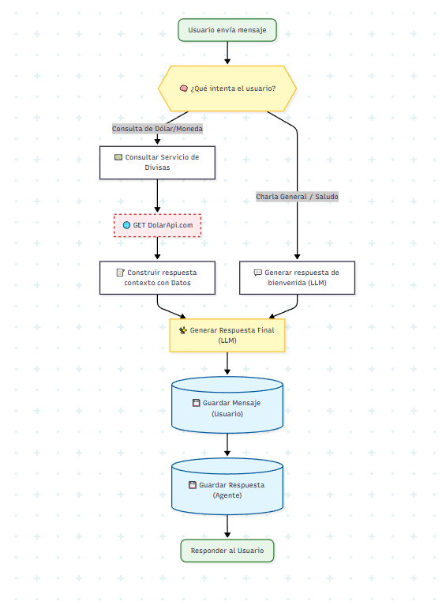

# Sistema Conversacional Distribuido (Enterprise Virtual Assistant)

Una arquitectura de microservicios escalable diseñada para asistentes virtuales empresariales, priorizando la soberanía de datos, el rendimiento y la integración con sistemas legados.

## 🚀 Stack Tecnológico

* **Lenguaje & Framework:** Java 21 + Spring Boot 4.x.
* **AI & LLM:** Google Gemma.
* **Persistencia:** H2 (In-Memory para Dev/Test) / PostgreSQL (Producción).
* **Comunicación:** REST (Síncrono).
* **Infraestructura:** Docker + Kubernetes.

## 🏗 Arquitectura del Sistema

El sistema se divide en 5 capas autónomas:

1. **Capa de Canales (Entrypoint):** Adaptadores normalizados para WhatsApp, Web Widget y Slack.
2. **Gateway & Seguridad:** `Auth Service` para validar tokens y `PII Filter` para redacción automática de datos sensibles antes de procesar.
3. **Capa de Orquestación (El Cerebro):**
* Mantiene el estado de la conversación (Redis) y decide si la consulta requiere RAG, una acción de integración o "Small Talk".
4. **Capa de Conocimiento (RAG):** Base de datos vectorial + Pipeline de ingesta para que Gemma responda basándose en PDFs/Docs internos.
5. **Capa de Integración:** Microservicios aislados para ejecutar acciones en CRMs, ERPs, etc.

## 💡 Decisiones Clave de Diseño

* **Google Gemma:** Modelo gratuito con amplia cantidad de RPD disponibles, lo que permite el testeo y el desarrollo de manera más rápida y eficiente. Además, al ser *open weights* permite ejecución *on-premise*, garantizando que los datos del negocio nunca salgan a APIs públicas de terceros.
* **H2 Database:** Base de datos embebida para acelerar el ciclo de desarrollo (CI/CD) y pruebas unitarias sin latencia de red.
* **Integración Desacoplada:** El LLM nunca toca la BD real; usa una capa de abstracción para seguridad y mantenibilidad.

---

## 🔑 Configuración del Modelo (Google AI Studio)

Este proyecto utiliza la infraestructura de Google AI Studio para inferencia, eliminando la necesidad de hardware local costoso.

1. Obtener una API Key en [Google AI Studio](https://aistudio.google.com/).
2. Seleccionar el modelo (Gemma 2 o Gemini 1.5 Flash).
3. Configurar la variable de entorno:

```bash
export GOOGLE_API_KEY="tu_api_key_aqui"

```

O la property key:
```properties
# application.properties
google.ai.api-key=${GOOGLE_AI_STUDIO_KEY}

```

## 🗺 Roadmap

* [ ] Implementación de Circuit Breaker para APIs externas.
* [ ] Dashboard de Analítica (Retención y Sentimiento).
* [ ] Migración de H2 a PostgreSQL para entorno Productivo.

---------------

# Agent Service - Desafío Galicia

Este proyecto es un servicio de backend para un chatbot inteligente diseñado para proporcionar información financiera en tiempo real. Aprovecha la Inteligencia Artificial Generativa para interpretar las intenciones de los usuarios y se integra con APIs externas para obtener cotizaciones de divisas.

## 🚀 Funcionalidades

* **Procesamiento de Lenguaje Natural (NLP)**: Utiliza Google GenAI (Gemma 3) para entender los *prompts* de los usuarios y mapearlos a intenciones accionables.
* **Información de Divisas**: Provee cotizaciones en tiempo real para varias monedas (Dólar, Euro, Real, etc.) mediante una integración con [DolarApi](https://dolarapi.com).
* **Chat Contextual**: Mantiene el historial del chat para brindar una experiencia conversacional fluida y continua.
* **Cliente de API Declarativo**: Utiliza Spring Cloud OpenFeign para una comunicación con APIs externas limpia y eficiente.

## 🛠 Stack Tecnológico

* **Lenguaje**: Java 21
* **Framework**: Spring Boot 4
* **Integración de IA**: Google GenAI SDK (`gemma-3-27b-it`)
* **Base de Datos**: H2 (En memoria)
* **Cliente HTTP**: Spring Cloud OpenFeign
* **Herramienta de Build**: Gradle

## 📋 Prerrequisitos

* SDK de Java 21 instalado.
* Una API Key de Google Cloud con acceso a los modelos de IA Generativa.

## ⚙️ Configuración

Antes de ejecutar la aplicación, es necesario configurar la variable de entorno `GOOGLE_API_KEY`.

En Linux/macOS:

```bash
export GOOGLE_API_KEY=tu_api_key_aqui

```

En Windows (PowerShell):

```powershell
$env:GOOGLE_API_KEY="tu_api_key_aqui"

```

Alternativamente, podés modificar `src/main/resources/application.properties` directamente (no recomendado si vas a commitear el código).

## 🏃‍♂️ Cómo Ejecutar

1. **Clonar el repositorio**:
```bash
git clone <url-del-repositorio>
cd agent-service

```


2. **Construir y Correr**:
Usando el *wrapper* de Gradle incluido en el proyecto:
```bash
./gradlew bootRun

```


O en Windows:
```powershell
.\gradlew.bat bootRun

```


La aplicación iniciará en el puerto `8080` (por defecto).

## 🔌 Uso de la API

### Endpoint de Chat

Interactuá con el agente enviando una petición POST.

* **URL**: `/chat`
* **Método**: `POST`
* **Content-Type**: `application/json`

#### Cuerpo del Request (Request Body)

| Campo | Tipo | Descripción |
| --- | --- | --- |
| `prompt` | String | El mensaje o pregunta del usuario. |
| `userId` | Long | ID del usuario (usado para rastrear la sesión si el chatId es nulo). |
| `chatId` | Long | (Opcional) El ID de la sesión de chat activa (devuelto en llamadas anteriores). |
| `context` | String | (Opcional) Contexto adicional para el LLM. |

#### Ejemplo de Request

```json
{
  "userId": 1,
  "prompt": "¿A cuánto está el dólar blue hoy?"
}

```

#### Ejemplo de Respuesta

```json
{
  "chatId": 1,
  "message": "El precio de compra actual del Dólar Blue es $1200 y el precio de venta es $1220."
}

```

## 🏗️ Arquitectura

A continuación, un diagrama de componentes que ilustra cómo interactúan las distintas partes del sistema:


Y un diagrama de flujo que ilustra el comportamiento standard


## 📂 Estructura del Proyecto

```
src/main/java/com/galicia/agentservice
├── AgentServiceApplication.java  # Punto de entrada principal
├── client                        # Clientes Feign (ej. CurrencyInfoClient)
├── controller                    # Controladores REST (AgentController)
├── model                         # Modelos de datos (DTOs, Enums)
├── repository                    # Capa de acceso a datos
└── service                       # Lógica de negocio (AgentService, LLMService, CurrencyService)

```
