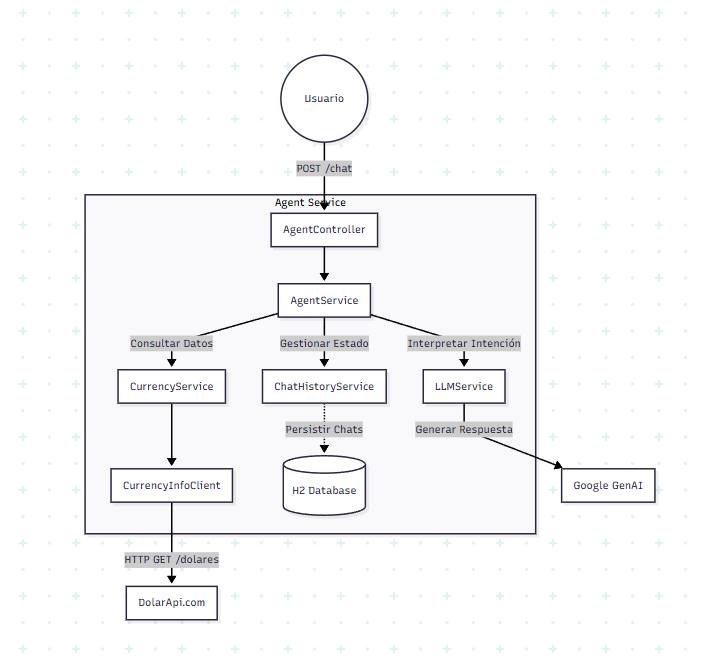

# Agent Service - Desafío Galicia

Este proyecto es un servicio de backend para un chatbot inteligente diseñado para proporcionar información financiera en tiempo real. Aprovecha la Inteligencia Artificial Generativa para interpretar las intenciones de los usuarios y se integra con APIs externas para obtener cotizaciones de divisas.

## 🚀 Funcionalidades

* **Procesamiento de Lenguaje Natural (NLP)**: Utiliza Google GenAI (Gemma 3) para entender los *prompts* de los usuarios y mapearlos a intenciones accionables.
* **Información de Divisas**: Provee cotizaciones en tiempo real para varias monedas (Dólar, Euro, Real, etc.) mediante una integración con [DolarApi](https://dolarapi.com).
* **Chat Contextual**: Mantiene el historial del chat para brindar una experiencia conversacional fluida y continua.
* **Cliente de API Declarativo**: Utiliza Spring Cloud OpenFeign para una comunicación con APIs externas limpia y eficiente.

## 🛠 Stack Tecnológico

* **Lenguaje**: Java 21
* **Framework**: Spring Boot 3+
* **Integración de IA**: Google GenAI SDK (`gemma-3-27b-it`)
* **Base de Datos**: H2 (En memoria)
* **Cliente HTTP**: Spring Cloud OpenFeign
* **Herramienta de Build**: Gradle

## 📋 Prerrequisitos

* SDK de Java 21 instalado.
* Una API Key de Google Cloud con acceso a los modelos de IA Generativa.

## ⚙️ Configuración

Antes de ejecutar la aplicación, es necesario configurar la variable de entorno `GOOGLE_API_KEY`.

En Linux/macOS:

```bash
export GOOGLE_API_KEY=tu_api_key_aqui

```

En Windows (PowerShell):

```powershell
$env:GOOGLE_API_KEY="tu_api_key_aqui"

```

Alternativamente, podés modificar `src/main/resources/application.properties` directamente (no recomendado si vas a commitear el código).

## 🏃‍♂️ Cómo Ejecutar

1. **Clonar el repositorio**:
```bash
git clone <url-del-repositorio>
cd agent-service

```


2. **Construir y Correr**:
Usando el *wrapper* de Gradle incluido en el proyecto:
```bash
./gradlew bootRun

```


O en Windows:
```powershell
.\gradlew.bat bootRun

```


La aplicación iniciará en el puerto `8080` (por defecto).

## 🔌 Uso de la API

### Endpoint de Chat

Interactuá con el agente enviando una petición POST.

* **URL**: `/chat`
* **Método**: `POST`
* **Content-Type**: `application/json`

#### Cuerpo del Request (Request Body)

| Campo | Tipo | Descripción |
| --- | --- | --- |
| `prompt` | String | El mensaje o pregunta del usuario. |
| `userId` | Long | ID del usuario (usado para rastrear la sesión si el chatId es nulo). |
| `chatId` | Long | (Opcional) El ID de la sesión de chat activa (devuelto en llamadas anteriores). |
| `context` | String | (Opcional) Contexto adicional para el LLM. |

#### Ejemplo de Request

```json
{
  "userId": 1,
  "prompt": "¿A cuánto está el dólar blue hoy?"
}

```

#### Ejemplo de Respuesta

```json
{
  "chatId": 1,
  "message": "El precio de compra actual del Dólar Blue es $1200 y el precio de venta es $1220."
}

```

## 🏗️ Arquitectura

A continuación, un diagrama de componentes que ilustra cómo interactúan las distintas partes del sistema:

```mermaid
componentDiagram
    actor Usuario
    package "Agent Service" {
        component [AgentController] as Controller
        component [AgentService] as AgentSvc
        component [LLMService] as LLMSvc
        component [CurrencyService] as CurrencySvc
        component [ChatHistoryService] as ChatSvc
        component [CurrencyInfoClient] as FeignClient
        database "H2 Database" as DB
    }
    
    component "Google GenAI" as GenAI
    component "DolarApi.com" as ExternalAPI

    Usuario --> Controller : POST /chat
    Controller --> AgentSvc
    AgentSvc --> ChatSvc : Gestionar Estado
    AgentSvc --> LLMSvc : Interpretar Intención
    AgentSvc --> CurrencySvc : Consultar Datos
    
    LLMSvc --> GenAI : Generar Respuesta
    CurrencySvc --> FeignClient
    FeignClient --> ExternalAPI : HTTP GET /dolares
    
    ChatSvc ..> DB : Persistir Chats
```

## 📂 Estructura del Proyecto

```
src/main/java/com/galicia/agentservice
├── AgentServiceApplication.java  # Punto de entrada principal
├── client                        # Clientes Feign (ej. CurrencyInfoClient)
├── controller                    # Controladores REST (AgentController)
├── model                         # Modelos de datos (DTOs, Enums)
├── repository                    # Capa de acceso a datos
└── service                       # Lógica de negocio (AgentService, LLMService, CurrencyService)

```
